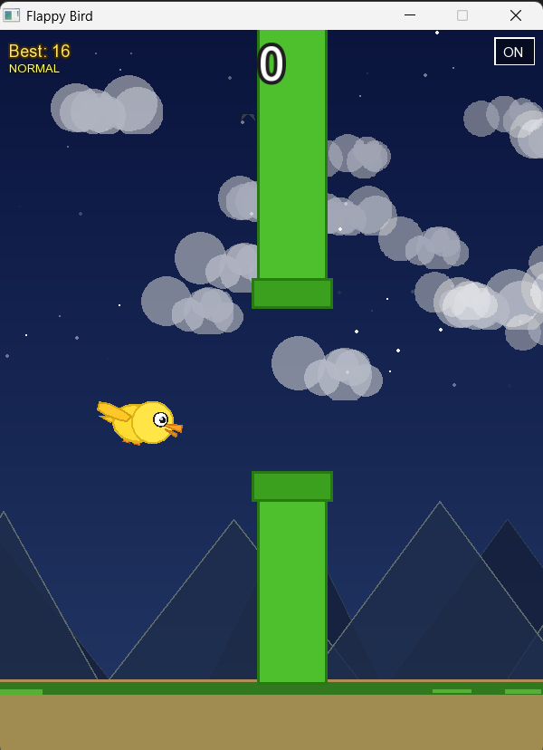
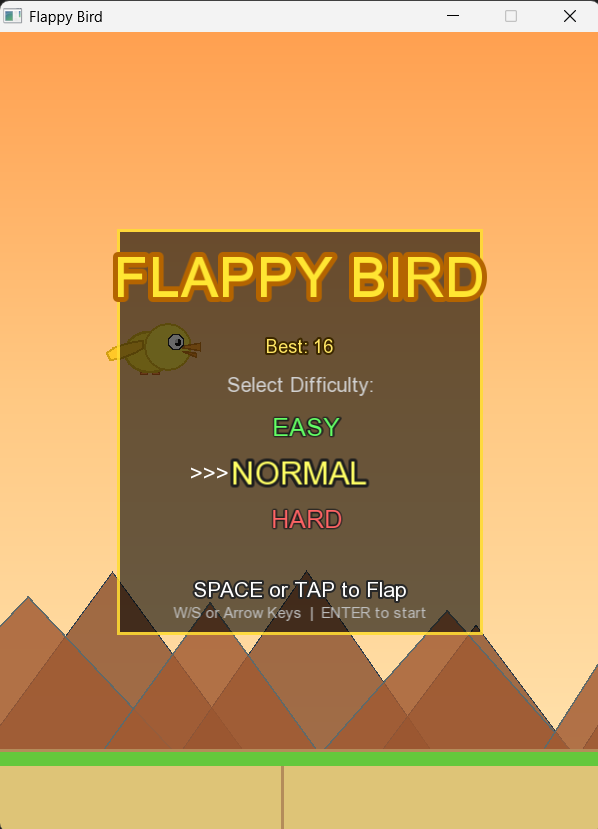
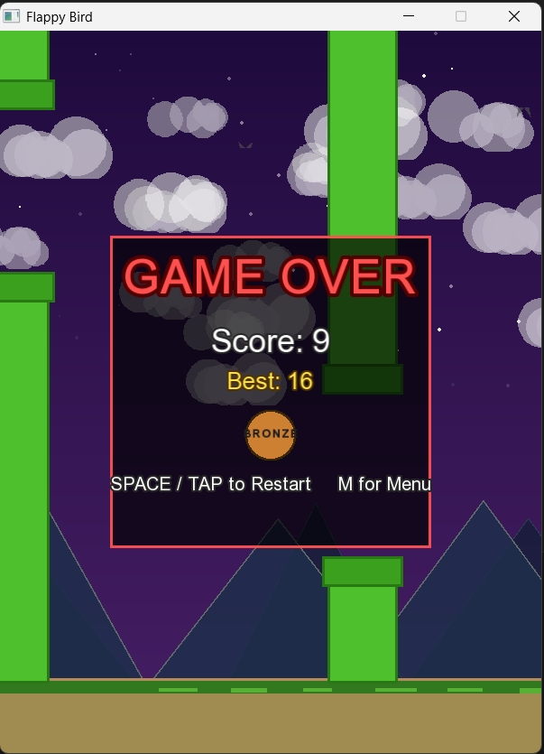

<div align="center">

# 🐦 FlappyBird Game

### *A fully professional Flappy Bird clone built with C++ & SFML*

<br/>

🌐 **[✨ Visit Live Landing Page ✨](https://souravbiswas35flappy-bird-game-land.vercel.app/)**

<br/>

[](https://github.com/souravbiswas35/Flappy-Bird-Game/releases/tag/v1.0)
[](LICENSE)
[](https://souravbiswas35flappy-bird-game-land.vercel.app/)
[](#-download--play)
[](#-tech-stack)

</div>

---

## 📖 About The Project

> **FlappyBird Game** is a feature-rich recreation of the iconic Flappy Bird game, engineered in **C++ 17** with the **SFML 2.6** multimedia library. It features a realistic multi-part bird with 6 animation states, a dynamic day/night sky cycle, parallax mountain layers, and procedural audio — all running at a locked **60 FPS** on any modern Windows PC.
>
> This repository also hosts the **dedicated landing page** — a fully animated, mobile-responsive HTML/CSS page deployed live on **Vercel**.

<br/>

---

## 🖼️ Screenshots

<div align="center">


&nbsp;

&nbsp;


*Gameplay &nbsp;·&nbsp; Main Menu &nbsp;·&nbsp; Game Over Screen*

</div>

<br/>

---

## 🎯 Game Features

| Feature | Details |
|:-------:|:--------|
| 🎨 **Realistic Bird** | 15+ body parts with 6 smooth animation states |
| 🌅 **Day / Night Cycle** | Dynamic sky — sunrise, day, dusk, night with twinkling stars |
| 🏔️ **Parallax Layers** | Mountains & clouds at 3 depths, plus background birds |
| ⚡ **60 FPS** | Silky-smooth SFML hardware-accelerated rendering |
| 🎵 **Procedural Audio** | Synthesized SFX — no WAV files required |
| 🏆 **High Score Saving** | Best score persisted to `highscore.dat` |
| 📱 **Responsive Design** | Auto-scales for mobile, tablet, and desktop |
| 🎮 **Touch & Mouse** | Optimized for both mobile tap and desktop click |
| 🥇 **Medal System** | Bronze → Silver → Gold based on your score |
| 🔊 **Audio Toggle** | Sound on/off button built into the game |

<br/>

---

## 🎮 Controls

### Desktop — Mouse + Keyboard

```
SPACE / CLICK       →  Flap wings / Confirm menu
W / UP ARROW        →  Menu: Move selection up
S / DOWN ARROW      →  Menu: Move selection down
ENTER               →  Start game from menu
ESC                 →  Pause / Resume
M                   →  Return to main menu
Click Sound Button  →  Toggle audio on/off
```

### Mobile — Touch
```
TAP SCREEN  →  Flap wings / Interact
```

<br/>

---

## 🏆 Difficulty Levels

```
┌──────────┬───────────┬──────────┬──────────┐
│ Mode     │ Gap Size  │ Speed    │ Spawn    │
├──────────┼───────────┼──────────┼──────────┤
│ EASY     │ 195px     │ 140px/s  │ 2.6s     │
│ NORMAL   │ 165px     │ 180px/s  │ 2.2s     │
│ HARD     │ 130px     │ 230px/s  │ 1.8s     │
└──────────┴───────────┴──────────┴──────────┘
```

**Medals:** 🥉 Bronze (5+) &nbsp;·&nbsp; 🥈 Silver (15+) &nbsp;·&nbsp; 🥇 Gold (30+)

<br/>

---

## 💻 Download & Play

<div align="center">

### ⬇️ [Download FlappyBird v1.0 for Windows](https://github.com/souravbiswas35/Flappy-Bird-Game/releases/download/v1.0/FlappyBird.zip)

```
🪟 Platform  :  Windows 10 / 11
📦 Format    :  .zip
🔧 Install   :  None — just unzip and run FlappyBird.exe
📁 Size      :  Lightweight
```

</div>

**Steps to play:**
1. Click the download link above
2. Extract the `.zip` to any folder
3. Double-click `FlappyBird.exe`
4. Press **Space** or **Click** to flap — dodge the pipes!

<br/>

---


</div>

**Steps to play:**
1. Click the download link above
2. Extract the `.zip` to any folder
3. Open **VS Code** terminal in that folder
4. Run the compile command:

```bash
g++ -std=c++17 -O2 -Wall main.cpp Game.cpp Game_render.cpp Game_init.cpp Bird.cpp Pipe.cpp -IC:/msys64/mingw64/SFML-2.5.1/SFML-2.5.1/include -LC:/msys64/mingw64/SFML-2.5.1/SFML-2.5.1/lib -lsfml-graphics -lsfml-window -lsfml-audio -lsfml-system -o FlappyBird.exe

FlappyBird.exe
```

</div>

## 🌐 Live Landing Page

<div align="center">

| 🔗 URL | 🚦 Status |
|:------:|:---------:|
| [souravbiswas35flappy-bird-game-land.vercel.app](https://souravbiswas35flappy-bird-game-land.vercel.app/) |  |

</div>

Deployed via **Vercel** — every push to `main` triggers an automatic redeploy.

```
✦ Animated sky with drifting clouds
✦ Pipe decorations left & right
✦ Bobbing bird with SVG wing animation
✦ Floating coins & star particles
✦ Shimmer-effect download button
✦ Scrolling ground stripe animation
✦ Fully responsive — desktop & mobile
✦ Google Fonts: Boogaloo + Nunito
```

<br/>

---

## ⚡ Tech Stack

<div align="center">

| Layer | Technology |
|:-----:|:----------:|
| 🎮 **Game Engine** | C++ 17 + SFML 2.6 |
| 🌐 **Landing Page** | HTML5 + CSS3 (no frameworks) |
| 🔤 **Fonts** | Google Fonts — Boogaloo, Nunito |
| 🎨 **Animations** | Pure CSS keyframes & SVG |
| 🚀 **Hosting** | Vercel (Auto-deploy from GitHub) |
| 🛠️ **Build** | MinGW-w64 GCC 13.x + VS Code |

</div>

<br/>

---

## 📂 Repository Structure

```
FlappyBirdPro/
│
├── 📄 index.html              ← Landing page (HTML + CSS + SVG)
├── 📄 Bird.h / Bird.cpp       ← Realistic bird (15+ shapes, 6 states)
├── 📄 Pipe.h / Pipe.cpp       ← Obstacle system
├── 📄 Game.h                  ← Game engine header
├── 📄 Game.cpp                ← Core game logic
├── 📄 Game_render.cpp         ← Layered rendering system
├── 📄 Game_init.cpp           ← Sky, clouds, mountains setup
├── 📄 main.cpp                ← Entry point
│
├── 📁 .vscode/
│   └── tasks.json             ← Build configuration
│
├── 📁 SFML/                   ← Place your SFML files here
│   ├── include/
│   ├── lib/
│   └── bin/
│
├── 📁 assets/
│   ├── 🖼️ banner.png
│   ├── 🖼️ screenshot-gameplay.png
│   ├── 🖼️ screenshot-menu.png
│   └── 🖼️ screenshot-gameover.png
│
├── 📄 README.md
├── 📄 UPGRADE_GUIDE.md        ← Detailed technical guide
├── 📄 QUICK_UPDATE.md         ← Fast reference
├── 📄 VISUAL_COMPARISON.md    ← Before/after comparison
└── 📄 LICENSE
```

<br/>

---

## 🧰 Requirements & Setup

### Software
- **Windows 10/11**
- **MinGW-w64** (GCC 13.x or later)
- **VS Code** with C++ extension
- **SFML 2.6.x** (GCC MinGW 64-bit build)

### Hardware
- Any modern CPU (Intel Core i3 / AMD equivalent or better)
- Integrated graphics sufficient (Intel HD / AMD APU)
- 512 MB available RAM

---

### 1️⃣ Install MinGW-w64

Download from: https://github.com/niXman/mingw-builds-binaries/releases

```
1. Download: x86_64-14.x.x-release-posix-seh-ucrt-rt_v12-rev0.7z
2. Extract to: C:\mingw64
3. Add to PATH: C:\mingw64\bin
4. Test in CMD: g++ --version
```

### 2️⃣ Download SFML

Download from: https://www.sfml-dev.org/download.php

```
1. Get: SFML 2.6.x — GCC MinGW (64-bit)
2. Extract ZIP
3. Copy contents to: FlappyBirdPro/SFML/
   ├── include/
   ├── lib/
   └── bin/
```

### 3️⃣ Build & Run

```
1. Open VS Code → File → Open Folder → FlappyBirdPro/
2. Install extension: C/C++ (by Microsoft)
3. Press Ctrl+Shift+B   →  builds FlappyBirdPro.exe
4. Copy ALL .dll files from SFML/bin/ next to the .exe
5. Double-click FlappyBirdPro.exe and enjoy! 🎮
```

<br/>

---

## 🎨 Technical Details

### Graphics
```
Shapes per frame  :  80–120
Color depth       :  24-bit RGB (16.7M colors)
Anti-aliasing     :  8× MSAA
Frame rate        :  60 FPS locked
```

### Physics
```
Gravity           :  1500 px/s²
Flap strength     :  −520 px/s
Terminal velocity :  ~1000 px/s
Rotation          :  Velocity-based (smooth)
```

### Audio
```
Synthesis         :  Procedural sine waves
Sample rate       :  44.1 kHz
Bit depth         :  16-bit  |  Channels: Mono
```

### Performance *(Intel i5-8250U + Intel UHD 620)*
```
FPS: 60 (locked)  |  Frame time: 16.6ms
RAM: ~45MB        |  CPU: ~8%
```

Runs on any PC from 2010 onwards.

<br/>

---

## 🐛 Troubleshooting

| Error | Fix |
|:------|:----|
| `g++: command not found` | Add `C:\mingw64\bin` to PATH, restart VS Code |
| `SFML/Graphics.hpp not found` | Ensure `SFML/include/` exists in project folder |
| `undefined reference to 'sf::...'` | Check link order: `-lsfml-graphics` BEFORE `-lsfml-window` |
| `sfml-graphics-2.dll not found` | Copy ALL `.dll` files from `SFML/bin/` next to the `.exe` |
| `No text / fonts not loading` | Game auto-tries `arial.ttf` and `calibri.ttf`; runs without fonts if missing |
| `Black screen / no graphics` | Update GPU drivers; try compatibility mode |
| `Game runs slow / choppy` | Close other apps; disable vsync in `Game.cpp` line 27 |

<br/>

---

## 🔧 Advanced Configuration

**Change Resolution** → `Game.h`:
```cpp
static const int BASE_WIDTH  = 480;
static const int BASE_HEIGHT = 854;
```

**Adjust Difficulty** → `Game.cpp` → `setDifficulty()`:
```cpp
Pipe::SPEED        = 140.f;  // Lower = easier
Pipe::GAP          = 195.f;  // Larger = easier
pipeSpawnInterval  = 2.6f;   // Longer = easier
```

**Change Bird Color** → `Bird.cpp`:
```cpp
body.setFillColor(sf::Color(255, 220, 50));
```

**Disable Visual Layers** → `Game_render.cpp`:
```cpp
// renderStars();
// renderMountains();
// renderBackgroundBirds();
```

<br/>

---

## 🎓 Code Architecture

```
main()
  └─ Game::Game()
       ├─ buildFonts()          buildSounds()
       ├─ buildSkySystem()      buildClouds()
       ├─ buildStars()          buildMountains()
       └─ buildUI()

  └─ Game::run()
       └─ while (window open)
            ├─ processEvents()
            ├─ update(dt)
            │    ├─ updateSky / Clouds / Stars / Mountains
            │    ├─ bird.update()
            │    └─ pipes.update()
            └─ render()
                 ├─ renderSky → Celestial → Stars → Mountains
                 ├─ renderClouds → Ground
                 ├─ pipes.draw() → bird.draw()
                 └─ renderHUD()
```

<br/>

---

## 🔮 Future Enhancements

- [ ] Weather effects (rain, snow, wind)
- [ ] Multiple bird skins (cardinal, eagle, parrot)
- [ ] Power-ups (shield, slow-motion, double points)
- [ ] Achievements system
- [ ] Local multiplayer co-op
- [ ] Level themes (desert, ocean, space)
- [ ] Seasonal events (Halloween, Christmas)
- [ ] Online leaderboard

<br/>

---

## 🙏 Credits

- **SFML Library** — Laurent Gomila & contributors · [sfml-dev.org/license.php](https://www.sfml-dev.org/license.php)
- **Original Game Design** — Flappy Bird by Dong Nguyen
- **C++ Implementation** — Original code for educational purposes

<br/>

---

<div align="center">

## 👤 Author

**Sourav Biswas**

[](https://github.com/souravbiswas35)

<br/>

<sub>Made with ❤️ in C++ &nbsp;·&nbsp; No external assets required! &nbsp;·&nbsp; Enjoy your professional Flappy Bird! 🐦🎮</sub>

</div>
